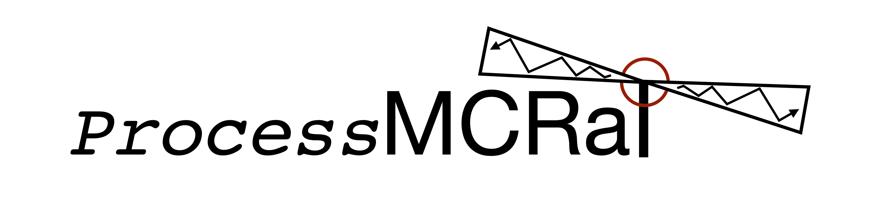

<!-- # ProcessMCRaT
A collection of python scripts are being developed by Tyler Parsotan in order to aid the general comunity in using the MCRaT code and processing the results of the radiative transfer simulations. These scripts are both tools and examples that can be used or modified to better fit the specific needs of the community.

These scripts and the documentation are under development and are still adapting to the developments that are occuring with MCRaT. 


*** Thanks for checking out the Best-README-Template. If you have a suggestion
*** that would make this better, please fork the repo and create a pull request
*** or simply open an issue with the tag "enhancement".
*** Thanks again! Now go create something AMAZING! :D
***
***
***
*** To avoid retyping too much info. Do a search and replace for the following:
*** parsotat, ProcessMCRaT, twitter_handle, email, project_title, project_description

steps to upload a distribution to PyPi is at: https://stackoverflow.com/questions/1471994/what-is-setup-py
can test a the distribution locally with 'pip install -e .' from the main directory
-->


<!-- PROJECT SHIELDS -->
<!--
*** I'm using markdown "reference style" links for readability.
*** Reference links are enclosed in brackets [ ] instead of parentheses ( ).
*** See the bottom of this document for the declaration of the reference variables
*** for contributors-url, forks-url, etc. This is an optional, concise syntax you may use.
*** https://www.markdownguide.org/basic-syntax/#reference-style-links
-->
[![Contributors][contributors-shield]][contributors-url]
[![Forks][forks-shield]][forks-url]
[![Stargazers][stars-shield]][stars-url]
[![Issues][issues-shield]][issues-url]
[![MIT License][license-shield]][license-url]  
[](https://scholar.google.com/citations?user=cIxaj3MAAAAJ&hl=en)
[](https://www.researchgate.net/profile/Tyler-Parsotan)
[](https://mybinder.org/v2/gh/parsotat/ProcessMCRaT/HEAD?filepath=notebooks%2Fprocessmcrat_example.ipynb)
<!-- <a href="https://ascl.net/2005.019"></a> -->


<!-- PROJECT LOGO -->
<br />
<p align="center">
  <a href="https://github.com/parsotat/ProcessMCRaT">
    
  </a>

  <h3 align="center">The ProcessMCRaT Library</h3>

  <p align="center">
    The ProcessMCRaT library is a python package that can be used to process the output of the <a href="https://github.com/lazzati-astro/MCRaT">MCRaT</a> code.
    <br />
    <a href="https://github.com/parsotat/ProcessMCRaT/tree/master/Doc"><strong>Explore the docs »</strong></a>
    <br />
    <br />
    <!-- <a href="https://github.com/parsotat/ProcessMCRaT">View Demo</a>
    · -->
    <a href="https://github.com/parsotat/ProcessMCRaT/issues">Report Bug</a>
    ·
    <a href="https://github.com/parsotat/ProcessMCRaT/issues">Request Feature</a>
  </p>
</p>


<!-- TABLE OF CONTENTS -->
<details open="open">
  <summary><h2 style="display: inline-block">Table of Contents</h2></summary>
  <ol>
    <li>
      <a href="#about-the-project">About The Project</a>
      <ul>
        <li><a href="#built-with">Built With</a></li>
      </ul>
    </li>
    <li>
      <a href="#getting-started">Getting Started</a>
      <ul>
        <li><a href="#prerequisites">Prerequisites</a></li>
        <li><a href="#installation">Installation</a></li>
      </ul>
    </li>
    <li><a href="#usage">Usage</a></li>
    <li><a href="#roadmap">Roadmap</a></li>
    <li><a href="#contributing">Contributing</a></li>
    <li><a href="#license">License</a></li>
    <li><a href="#contact">Contact</a></li>
    <li><a href="#acknowledgements">Acknowledgements</a></li>
  </ol>
</details>


<!-- ABOUT THE PROJECT -->
## About The Project

<!-- [![Product Name Screen Shot][product-screenshot]](https://example.com) -->

The ProcessMCRaT package allows for the outputs of the MCRaT simulations to be processed in a number of different ways. 
The package allows the user to quickly analyze the MCRaT simulation by conveniently creating a number of mock observations 
for a variety of observer viewing angles and then use those observations to calculate spectra, light curves, and polarizations. 
The package also includes convenience plotting functions that allow quick, convenient plotting of these various quantities 
to fully explore the MCRaT results. These functions are also meant to be examples of how to work with the outputs of the 
ProcessMCRaT library. Additionally, the package also includes support for analyzing the position of photons in a given 
hydrodynamic simulation, allowing for analysis of hydrodynamic structures and mock observables at the same time. 


There is also a Jupyter notebook that is included on Github that outlines the usage of the library, and many 
functionalities that the library offers. This notebook can be accessed by cloning the repository or loading the notebook 
in Binder  (see the <a href="#usage">Usage</a> section). The detailed documentation for each function is still under 
development, but the Jupyter notebook covers the ways that each function can be used.


### Built With

* [Python](https://www.python.org/)

<!-- GETTING STARTED -->
## Getting Started

To get a local copy up and running follow these simple steps.

### Prerequisites

The following are necessary to use the ProcessMCRaT code :
* The output of a  [MCRaT](https://github.com/lazzati-astro/MCRaT) simulation
* [Python](https://www.python.org/)  -- we recommend installing Python 3 using [Anaconda](https://docs.anaconda.com/anaconda/install/)
    * Necessary packages under Python are numpy, scipy, matplotlib, h5py, pickle, tables and random -- many of these will be included in the base installation if using Anaconda and those that are not can easily be installed using the `conda` command line interface


### Installation

1. Use pip install
   ```sh
   pip install ProcessMCRaT
   ```
3. Test the installation by running `python -c "import processmcrat as pm"` or by trying the Jupyter documentation notebook included in the  github 
    *   To gain access to the Jupyter notebook, either clone the repo with `git clone https://github.com/parsotat/ProcessMCRaT.git` and run `Jupyter notebook` at the comand line in the notebooks directory

<!-- _These steps are provided in greater detail in the included [Jupyter notebook](https://github.com/parsotat/ProcessMCRaT/tree/master/notebooks)_ -->


<!-- USAGE EXAMPLES -->
## Usage

The typical steps in using the ProcessMCRaT library is shown in the included Jupyter notebook, with explainations of the many functions that are included in the package. To access the notebook, either:
*   To gain access to the Jupyter notebook, either clone the repo with `git clone https://github.com/parsotat/ProcessMCRaT.git` and run `Jupyter notebook` at the comand line in the notebooks directory
Or
*   Access the notebook interactively online via Binder. You can click the launch Binder link at the top of the ReadMe or go directly to [https://mybinder.org/v2/gh/parsotat/ProcessMCRaT/HEAD?filepath=notebooks%2Fprocessmcrat_example.ipynb](https://mybinder.org/v2/gh/parsotat/ProcessMCRaT/HEAD?filepath=notebooks%2Fprocessmcrat_example.ipynb)

<!-- _For more details, please refer to the included [Jupyter notebook](https://github.com/parsotat/ProcessMCRaT/tree/master/notebooks)_ -->


<!-- ROADMAP -->
## Roadmap

1. The code will include the means to include various instrument response functions in the creation of mock observed light curves, spectra, and polarizations.

See the [open issues](https://github.com/parsotat/ProcessMCRaT/issues) for a list of proposed features (and known issues).


<!-- CONTRIBUTING -->
## Contributing

Contributions are what make the open source community such an amazing place to be learn, inspire, and create. Any contributions you make are **greatly appreciated**.

1. Fork the Project
2. Create your Feature Branch (`git checkout -b feature/AmazingFeature`)
3. Commit your Changes (`git commit -m 'Add some AmazingFeature'`)
4. Push to the Branch (`git push origin feature/AmazingFeature`)
5. Open a Pull Request


<!-- LICENSE -->
## License

Distributed under the MIT License. See `LICENSE` for more information.


<!-- CONTACT -->
## Contact

Tyler Parsotan - [Personal Website](https://http://sites.science.oregonstate.edu/~parsotat/) - parsotat@umbc.edu

Project Link: [https://github.com/parsotat/ProcessMCRaT](https://github.com/parsotat/ProcessMCRaT)


<!-- ACKNOWLEDGEMENTS -->
## Acknowledgements

* In using ProcessMCRaT and the MCRaT codes, we ask that you cite the following papers: 
    * [Lazzati (2016)](https://doi.org/10.3847/0004-637X/829/2/76)
    * [Parsotan & Lazzati (2018)](https://doi.org/10.3847/1538-4357/aaa087)
    * [Parsotan et al. (2018)](https://doi.org/10.3847/1538-4357/aaeed1)
    * [Parsotan et. al. (2020)](https://doi.org/10.3847/1538-4357/ab910f)
    * [Parsotan & Lazzati (2021)](https://doi.org/10.3847/1538-4357/ac2428)
    * [Parsotan & Lazzati (2022)](https://doi.org/10.3847/1538-4357/ac4093)
* [README Template from: othneildrew/Best-README-Template](https://github.com/othneildrew/Best-README-Template)


<!-- MARKDOWN LINKS & IMAGES -->
<!-- https://www.markdownguide.org/basic-syntax/#reference-style-links -->
[contributors-shield]: https://img.shields.io/github/contributors/parsotat/ProcessMCRaT.svg?style=for-the-badge
[contributors-url]: https://github.com/parsotat/ProcessMCRaT/graphs/contributors
[forks-shield]: https://img.shields.io/github/forks/parsotat/ProcessMCRaT.svg?style=for-the-badge
[forks-url]: https://github.com/parsotat/ProcessMCRaT/network/members
[stars-shield]: https://img.shields.io/github/stars/parsotat/ProcessMCRaT.svg?style=for-the-badge
[stars-url]: https://github.com/parsotat/ProcessMCRaT/stargazers
[issues-shield]: https://img.shields.io/github/issues/parsotat/ProcessMCRaT.svg?style=for-the-badge
[issues-url]: https://github.com/parsotat/ProcessMCRaT/issues
[license-shield]: https://img.shields.io/github/license/parsotat/ProcessMCRaT.svg?style=for-the-badge
 [license-url]: https://github.com/parsotat/ProcessMCRaT/blob/master/LICENSE
<!-- [linkedin-shield]: https://img.shields.io/badge/-LinkedIn-black.svg?style=for-the-badge&logo=linkedin&colorB=555 
[linkedin-url]: https://linkedin.com/in/parsotat -->
